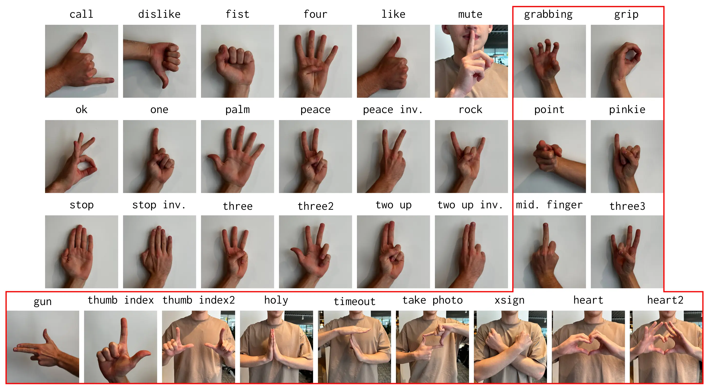

# 检测手势控制鼠标事件

## 运行
linux
```
./run.sh
```
windows
```
```
## 使用
1. 点击右上角设置，设置参数，添加任务
2. 返回主界面，点击运行即可
## 手势任务说明
### 操作
* 点击`Add Mouse Task`按钮添加任务
* `[pyautogui]PAUSE`为任务间隔时间
* 单击边框改变状态(绿色执行，红色不执行)
* 长按边框删除任务
### 任务触发条件
`last`=`Last Gesture Name`  
`now`=`Now Gesture Name`
|运行条件|`last(all)`|`last(not all)`|
|:-:|:-:|:-:|
|**`now(all)`**|一直运行|当手势不为last时|
|**`now(not all)`**|当手势为now时|当手势由last转为now时|

### Keypoint ID
传递关键点坐标，用于 moveTo 任务
### Mouse Task
鼠标任务种类：
* moveTo：鼠标移动至关键点对应屏幕位置
* mouse up：鼠标按下按键
* mouse down：鼠标松开按键
* click：鼠标点击按键
### Mouse Name：
鼠标按键种类：
* left：鼠标左键
* right：鼠标右键
## 手势种类



## todo))
- [ ] 数据持久化
- [ ] 其他平台启动脚本
- [ ] `gpu`模型添加
- [ ] `keyboard`事件


## 致谢
* [可爱 `raye` 图片](https://www.pixiv.net/artworks/67786450)
* [flet 使用python轻松创建应用](https://github.com/flet-dev/flet)
* [pyautogui 一个跨平台 GUI 自动化模块](https://github.com/asweigart/pyautogui)
* [手势模型](https://github.com/hukenovs/hagrid)
* [cvzone](https://github.com/cvzone/cvzone)
  